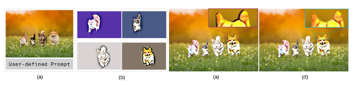

# Shape Cloud Collage on Irregular Canvas
# 
# 

Hong-Son Nguyen and Thi-Ngoc-Hanh Le*

Region-based neural style transfer serves benefits in interactive content creation, digital art, and personalized media generation. Particularly, it enables fine-grained artistic control by allowing different semantic regions of an image to be stylized independently. However, compositing independently stylized regions often leads to boundary artifact, such as halos, abrupt transitions, inter-object style leakage, which significantly degrade visual quality. We propose Interior-Guided Border Repair with Inward Feathering (IGBF), a lightweight and model-agnostic method that improves boundary handling in multi-region stylization. IGBF repairs boundary pixels using interior-guided propagation and applies inward, distance-based blending that is restricted to object-background boundaries, preventing inter-object style leakage. The method is derived from a region-wise constrained formulation with a closed-form solution and can be seamlessly integrated into existing stylization pipelines without retraining. To evaluate efficiency of our IGBF, we introduce quantitative metrics that measure boundary consistency, gradient artifacts, inter-object leakage, and interior preservation without requiring annotated stylized images. Our experiments demonstrate that IGBF consistently produces plausible boundaries in multi-region stylization results than prior blending techniques.

## Code

It is accepted by IEEE Transactions on Visualization and Computer Graphics (2025/04).
